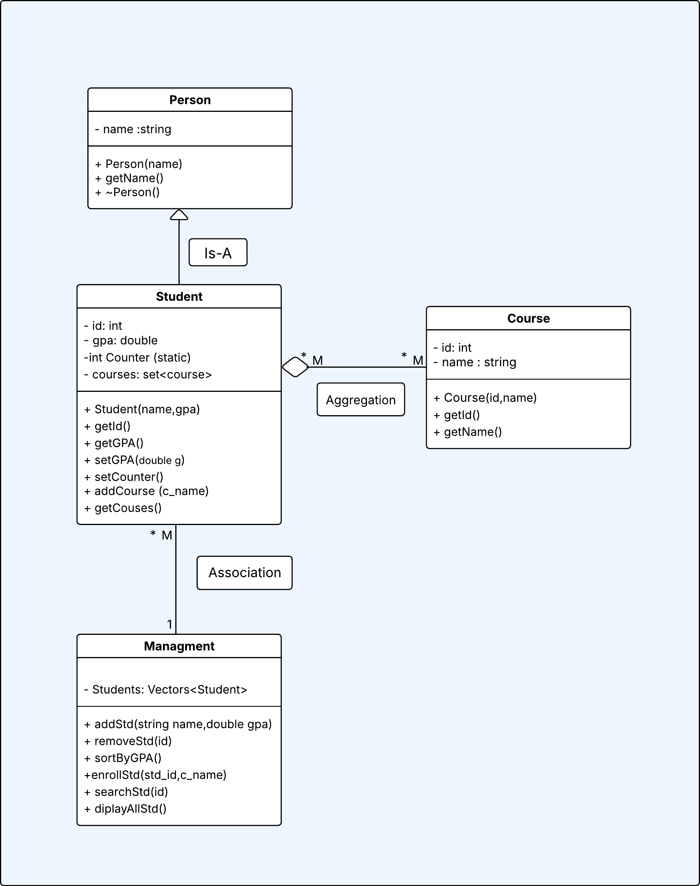

# Student & Course Management System

## About the Project
I built this project as a simple console application in C++ to manage students and their courses. The idea was to practice OOP concepts and also solve a real problem: how to store and manage student data without losing it after closing the program.

---
## 📊 System Design
Below is the UML class diagram showing the relationships between classes (Inheritance, Aggregation, and Association).

---
## What I implemented

### 1. OOP Design
I used Object-Oriented Programming to organize the project:
- A base class `Person`
- A derived class `Student`

This helped me separate common data and make the code cleaner and easier to extend.

---

### 2. Managing Students
I stored all students in a `vector`.  
Each student has:
- ID (auto-generated)
- Name
- GPA
- List of enrolled courses

---

### 3. Course System
Instead of typing course names manually, I created predefined courses with IDs.  
This made the system more realistic and avoided mistakes in input.

Each student can enroll in courses, and I made sure the same course can't be added twice.

---

### 4. File Handling (Save & Load)
One important part I worked on was saving data.

- I saved all students in a file called `students.txt`
- When the program starts, it loads the data automatically
- This prevents losing data after closing the program

I used `fstream` and `stringstream` to read and split the data.

---

## How to use the program

1. Run the project using Visual Studio
2. You will see a menu with options (0 → 7)
3. Choose any operation by typing its number
4. Follow the instructions on screen

⚠️ Important:
Always choose `0` (Exit) before closing, so the data gets saved correctly.

---

## Features

- Add new students
- Remove students
- Search by ID
- Display all students
- Sort students by GPA
- Enroll students in courses
- Display student courses
- Save and load data from file

---

## Challenges I faced

- Handling file parsing correctly (especially courses)
- Avoiding crashes when reading wrong or empty data
- Making sure IDs stay unique after reloading the file

---

## Limitations

- The program uses a text file, so it’s not suitable for large systems
- No graphical interface (only console)
- No validation for duplicate student names

---

## Future Improvements

- Use a database instead of a text file
- Add a simple GUI
- Improve input validation
- Add editing (update student data)

---

## Final Note

This project helped me understand OOP, file handling, and how real systems manage data step by step.  
I also learned how small mistakes in input or file parsing can cause crashes, and how to debug them.
